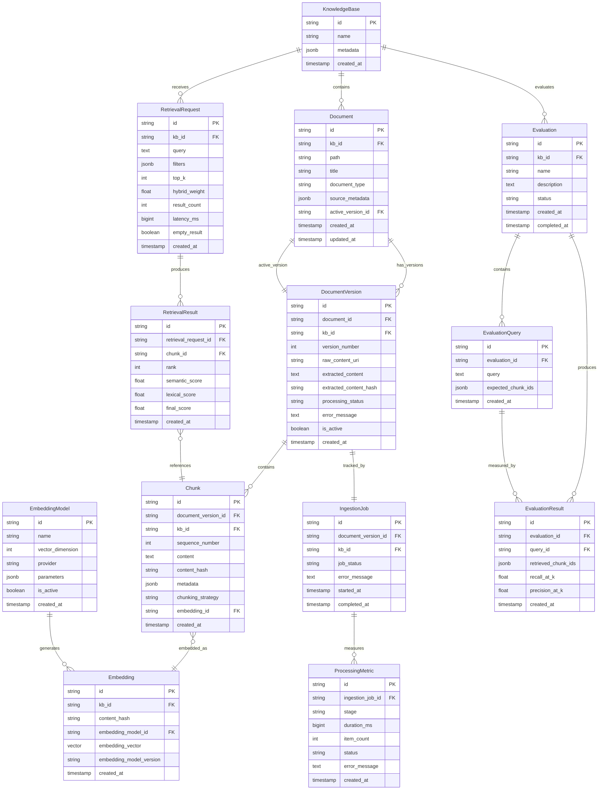

# High-Level Implementation Plan: RAG Knowledge Base

## Overview
This plan outlines the business objects, ER relationships, and high-level architecture for implementing the versioned, observable RAG knowledge base system.

## Architecture Decisions
- **Embedding Service**: Separate Python/FastAPI microservice
- **Processing Model**: Synchronous (MVP)
- **Vector Storage**: pgvector (Postgres extension)
- **Embedding Storage**: Separate embedding tables per vector dimension; `EmbeddingModel.VectorDimension` determines which table to query/write
- **Object Storage**: Railway Buckets (S3-compatible API)
- **Backend Language**: Go 1.22+ (using stdlib http routing)
- **Database**: PostgreSQL 15+ with pgvector extension
- **Observability**: OpenTelemetry Collector (logs, metrics, traces)

---

## 1. Core Business Objects (Go Domain Types)

### 1.1 Knowledge Base
```go
type KnowledgeBase struct {
    ID        string    // UUID
    Name      string
    Metadata  JSONMap   // tags, access control, etc.
    CreatedAt time.Time
    UpdatedAt time.Time
}
```

### 1.2 Document
```go
type Document struct {
    ID               string    // UUID - stable identity
    KBID             string    // Foreign key to KnowledgeBase
    Path             string    // Source locator (e.g., "docs/guide.md")
    Title            string    // Mutable metadata
    DocumentType     string    // "markdown", "pdf", "docx", etc.
    SourceMetadata   JSONMap   // tags, custom fields
    ActiveVersionID  *string   // Pointer to current active DocumentVersion
    CreatedAt        time.Time
    UpdatedAt        time.Time
}
```

### 1.3 Document Version
```go
type ProcessingStatus string

const (
    StatusReceived          ProcessingStatus = "RECEIVED"
    StatusStored            ProcessingStatus = "STORED"
    StatusExtracted         ProcessingStatus = "EXTRACTED"
    StatusChunked           ProcessingStatus = "CHUNKED"
    StatusEmbedded          ProcessingStatus = "EMBEDDED"
    StatusActivated         ProcessingStatus = "ACTIVATED"
    StatusSkippedUnsupported ProcessingStatus = "SKIPPED_UNSUPPORTED"
    StatusFailed            ProcessingStatus = "FAILED"
)

type DocumentVersion struct {
    ID                   string           // UUID
    DocumentID           string           // Foreign key to Document
    KBID                 string           // Foreign key to KnowledgeBase
    VersionNumber        int              // Incremental per document
    RawContentURI        string           // S3 path to raw bytes
    ExtractedContent     *string          // Normalized text after extraction
    ExtractedContentHash *string          // SHA256 for change detection
    ProcessingStatus     ProcessingStatus
    ErrorMessage         *string          // If processing failed
    IsActive             bool             // Only one active per document
    CreatedAt            time.Time
}
```

### 1.4 Chunk
```go
type Chunk struct {
    ID                string    // UUID
    DocumentVersionID string    // Foreign key to DocumentVersion
    KBID              string    // Denormalized for query efficiency
    SequenceNumber    int       // Order within version
    Content           string    // Actual text to embed and retrieve
    ContentHash       string    // SHA256 for reuse detection
    Metadata          JSONMap   // section headers, offsets, type (heading, paragraph, code)
    ChunkingStrategy  string    // e.g., "structural_v1"
    EmbeddingID       *string   // Foreign key to Embedding (nullable for stored-only)
    CreatedAt         time.Time
}
```

### 1.5 Embedding
```go
type Embedding struct {
    ID                   string      // UUID
    KBID                 string      // For scoped queries and dedup
    ContentHash          string      // To identify reused embeddings
    EmbeddingModelID     string      // Foreign key to EmbeddingModel
    EmbeddingVector      []float32   // Vector (pgvector; stored in dimension-specific embedding table)
    EmbeddingModelVersion string     // e.g., "v1.0"
    CreatedAt            time.Time
}
```

### 1.6 Embedding Model (Reference)
```go
type EmbeddingModel struct {
    ID              string   // e.g., "openai-text-embedding-3-small"
    Name            string
    VectorDimension int      // e.g., 1536 (used to route to the correct embedding table)
    Provider        string   // "openai", "huggingface", etc.
    Parameters      JSONMap  // JSON config
    IsActive        bool     // Current MVP model
    CreatedAt       time.Time
}
```

### 1.7 Retrieval Request (Observability)
```go
type RetrievalRequest struct {
    ID           string    // UUID / request_id
    KBID         string    // Foreign key to KnowledgeBase
    Query        string    // Natural language query
    Filters      JSONMap   // source, tags, path_prefix, timestamps
    TopK         int       // Number of results requested
    HybridWeight float64   // Semantic vs. lexical blend (0.0-1.0)
    ResultCount  int       // How many chunks returned
    LatencyMS    int64     // Wall-clock time
    EmptyResult  bool      // Flag if no results found
    CreatedAt    time.Time
}
```

### 1.8 Retrieval Result (Observability)
```go
type RetrievalResult struct {
    ID                 string    // UUID
    RetrievalRequestID string    // Foreign key to RetrievalRequest
    ChunkID            string    // Foreign key to Chunk
    Rank               int       // Position in results (1-indexed)
    SemanticScore      float64   // Normalized vector similarity
    LexicalScore       float64   // Normalized BM25/full-text score
    FinalScore         float64   // Blended score
    CreatedAt          time.Time
}
```

### 1.9 Ingestion Job (Observability)
```go
type JobStatus string

const (
    JobQueued     JobStatus = "QUEUED"
    JobInProgress JobStatus = "IN_PROGRESS"
    JobSuccess    JobStatus = "SUCCESS"
    JobFailed     JobStatus = "FAILED"
)

type IngestionJob struct {
    ID                string     // UUID
    DocumentVersionID string     // Foreign key to DocumentVersion
    KBID              string     // Foreign key to KnowledgeBase
    JobStatus         JobStatus
    ErrorMessage      *string    // If failed
    StartedAt         *time.Time
    CompletedAt       *time.Time
}
```

### 1.10 Processing Metric (Observability)
```go
type ProcessingStage string

const (
    StageReceived  ProcessingStage = "RECEIVED"
    StageStored    ProcessingStage = "STORED"
    StageExtracted ProcessingStage = "EXTRACTED"
    StageChunked   ProcessingStage = "CHUNKED"
    StageEmbedded  ProcessingStage = "EMBEDDED"
    StageActivated ProcessingStage = "ACTIVATED"
)

type ProcessingMetric struct {
    ID              string          // UUID
    IngestionJobID  string          // Foreign key to IngestionJob
    Stage           ProcessingStage
    DurationMS      int64           // Time taken
    ItemCount       int             // e.g., chunks created, embeddings generated
    Status          string          // "SUCCESS", "FAILURE"
    ErrorMessage    *string         // If failed at this stage
    CreatedAt       time.Time
}
```

### 1.11 Evaluation (Minimal Schema - Not Implemented Yet)

These objects enable future evaluation capabilities but won't be implemented in the initial MVP:

```go
type Evaluation struct {
    ID          string    // UUID
    KBID        string    // Foreign key to KnowledgeBase
    Name        string    // e.g., "Q1 2026 Quality Baseline"
    Description string
    Status      string    // "PENDING", "RUNNING", "COMPLETED", "FAILED"
    CreatedAt   time.Time
    CompletedAt *time.Time
}

type EvaluationQuery struct {
    ID               string    // UUID
    EvaluationID     string    // Foreign key to Evaluation
    Query            string    // Natural language query
    ExpectedChunkIDs []string  // Ground truth (JSONB array)
    CreatedAt        time.Time
}

type EvaluationResult struct {
    ID               string    // UUID
    EvaluationID     string    // Foreign key to Evaluation
    QueryID          string    // Foreign key to EvaluationQuery
    RetrievedChunkIDs []string // Actual results (JSONB array)
    RecallAtK        float64   // Recall@K metric
    PrecisionAtK     float64   // Precision@K metric
    CreatedAt        time.Time
}
```

**Note**: These tables will be created in the initial migration but no API endpoints or business logic will be implemented yet.

---

## 2. Entity Relationship Diagram

**Note**: The ER diagram shows a logical `Embedding` entity. In the physical schema, embeddings are stored in separate tables per vector dimension (e.g., `embeddings_1536`, `embeddings_3072`) to satisfy pgvector indexing requirements. The `EmbeddingModel.VectorDimension` value determines which table to read/write.



---

## 3. API Structure

### 3.1 Retrieval API
- `POST /v1/kb/{kb_id}/retrieve` - Search for chunks
  - **Input**: Query, filters, top_k, hybrid_weight
  - **Output**: Ranked results with scores and citations

### 3.2 Document Management API
- `POST /v1/kb/{kb_id}/documents` - Upload new document
- `PUT /v1/kb/{kb_id}/documents/{doc_id}` - Update document metadata (title, tags)
- `GET /v1/kb/{kb_id}/documents/{doc_id}` - Fetch document details
- `GET /v1/kb/{kb_id}/documents` - List documents (paginated, filterable)
- `DELETE /v1/kb/{kb_id}/documents/{doc_id}` - Delete document and all versions

### 3.3 Document Version API
- `GET /v1/kb/{kb_id}/documents/{doc_id}/versions` - List version history
- `GET /v1/kb/{kb_id}/documents/{doc_id}/versions/{version_id}` - Get specific version details
- `POST /v1/kb/{kb_id}/documents/{doc_id}/versions` - Create new version (re-upload)

### 3.4 Evaluation API (Not Implemented Yet)
**Note**: Evaluation database schema will be created, but no API endpoints or business logic will be implemented in the initial MVP. Future endpoints will include:
- `POST /v1/kb/{kb_id}/evaluations` - Run evaluation
- `GET /v1/kb/{kb_id}/evaluations/{eval_id}/metrics` - Get metrics (Recall@K, Precision@K)
- `POST /v1/kb/{kb_id}/evaluations/{eval_id}/queries` - Add test queries

### 3.5 Chunking Preview API
- `POST /v1/chunking/preview` - Preview chunking output without ingestion or embedding

**Request JSON**
```json
{
  "text": "section1\n\nsection2",
  "strategy": "recursive",
  "max_runes": 1200,
  "overlap_runes": 100,
  "separators": ["\n\n", "\n", " ", ""],
  "language_hints": ["python"]
}
```

**Response JSON**
```json
{
  "strategy": "recursive",
  "max_runes": 1200,
  "overlap_runes": 100,
  "separators": ["\nclass ", "\ndef ", "\n\n", "\n", " ", ""],
  "chunks": [
    {
      "index": 0,
      "start_rune": 0,
      "end_rune": 12,
      "content": "section1\n\n",
      "rune_length": 12
    },
    {
      "index": 1,
      "start_rune": 0,
      "end_rune": 20,
      "content": "section1\n\nsection2",
      "rune_length": 20
    }
  ]
}
```

**Curl Example**
```bash
curl -X POST http://localhost:8080/v1/chunking/preview \\
  -H "Content-Type: application/json" \\
  -d '{
    "text": "section1\\n\\nsection2",
    "strategy": "recursive",
    "max_runes": 10,
    "overlap_runes": 0,
    "language_hints": ["python"]
  }'
```

---

## 4. Backend Architecture

### 4.1 Technology Stack
- **Language**: Go 1.22+ (using stdlib http routing with enhanced ServeMux)
- **HTTP Framework**: Standard library net/http (no external router needed)
- **Database**: PostgreSQL 15+ with pgvector extension
- **Query Layer**: sqlc (type-safe SQL code generation)
- **Migrations**: golang-migrate
- **Object Storage**: Railway Buckets (S3-compatible API)
- **Embedding Service Client**: Standard HTTP client to FastAPI
- **Observability**: OpenTelemetry SDK → OTEL Collector (traces, metrics, logs)

### 4.2 Layered Architecture
```
┌─────────────────────────────────────────┐
│          HTTP Handlers Layer            │
│  (stdlib http routes, request/response) │
└─────────────────────────────────────────┘
                    │
┌─────────────────────────────────────────┐
│          Service Layer                  │
│  (Business logic, orchestration)        │
│  - DocumentService                      │
│  - RetrievalService                     │
│  - IngestionService                     │
│  - ChunkingService                      │
│  - EmbeddingService (HTTP client)       │
└─────────────────────────────────────────┘
                    │
┌─────────────────────────────────────────┐
│        Repository Layer                 │
│  (Database access, queries)             │
│  - DocumentRepository                   │
│  - ChunkRepository                      │
│  - EmbeddingRepository                  │
│  - RetrievalRepository                  │
└─────────────────────────────────────────┘
                    │
┌─────────────────────────────────────────┐
│     Infrastructure Layer                │
│  - PostgreSQL (pgvector)                │
│  - Railway Buckets (S3-compatible)      │
│  - FastAPI Embedding Service (HTTP)     │
│  - OTEL Collector (observability)       │
└─────────────────────────────────────────┘
```

### 4.3 Key Components

#### DocumentService
- Orchestrates document upload and versioning
- Creates Document and DocumentVersion records
- Coordinates with StorageService and IngestionService

#### IngestionService
- Manages synchronous ingestion pipeline
- Steps: Received → Stored → Extracted → Chunked → Embedded → Activated
- Records ProcessingMetrics for observability
- Handles activation transaction (atomic switch)

#### ChunkingService
- Structural chunking for Markdown
- Deterministic (same input = same chunks)
- Generates Chunk records with metadata (section headers, offsets)

#### EmbeddingService (HTTP client)
- Calls FastAPI service for embedding generation
- Batches chunk content
- Implements retry logic and error handling
- Reuses embeddings via content_hash lookup

#### RetrievalService
- Orchestrates hybrid search (semantic + lexical)
- Calls EmbeddingService for query embedding
- Performs vector similarity (pgvector) and full-text search (Postgres)
- Blends scores and applies metadata filters
- Returns top-K with citations

#### StorageService
- Uploads raw documents to Railway Buckets (S3-compatible API)
- Uploads extracted content to Railway Buckets
- Generates URIs (e.g., `railway-bucket://{bucket}/kb-{kb_id}/documents/{doc_id}/versions/{version_id}/raw`)

#### ObservabilityService
- Initializes OpenTelemetry SDK with OTEL Collector endpoint
- Exports traces, metrics, and logs to OTEL Collector
- Collector handles routing to observability backends (Grafana, Prometheus, etc.)
- Instruments HTTP handlers, database queries, and external service calls
- Records custom metrics: ingestion_duration, retrieval_latency, chunk_count, embedding_reuse_rate

---

## 5. Ingestion Pipeline Flow (Synchronous)

```
1. Client uploads document via POST /v1/kb/{kb_id}/documents
   └─> HTTP Handler receives multipart/form-data

2. DocumentService.CreateDocument()
   └─> Create Document record (stable ID, path, metadata)
   └─> Create DocumentVersion record (status=RECEIVED)
   └─> Create IngestionJob record (status=IN_PROGRESS)

3. StorageService.UploadRaw()
   └─> Upload raw bytes to Railway Buckets: railway-bucket://{bucket}/.../raw
   └─> Update DocumentVersion: raw_content_uri, status=STORED
   └─> Record ProcessingMetric (STORED stage)

4. Type Check
   └─> If unsupported (PDF, images):
       └─> Update status=SKIPPED_UNSUPPORTED
       └─> Mark IngestionJob as SUCCESS (stored-only)
       └─> Return response
   └─> If supported (Markdown): continue

5. ExtractionService.ExtractContent()
   └─> Parse Markdown, normalize text
   └─> Compute content hash (SHA256)
   └─> Check for duplicate content (by hash)
       └─> If duplicate: reuse existing chunks/embeddings, skip to activation
   └─> Update DocumentVersion: extracted_content, hash, status=EXTRACTED
   └─> Record ProcessingMetric (EXTRACTED stage)

6. ChunkingService.ChunkContent()
   └─> Apply structural chunking (headers, paragraphs, code blocks)
   └─> Generate Chunk records (content, sequence_number, metadata)
   └─> Compute content_hash per chunk
   └─> Batch insert Chunks
   └─> Update status=CHUNKED
   └─> Record ProcessingMetric (CHUNKED stage, item_count=num_chunks)

7. EmbeddingService.GenerateEmbeddings()
   └─> Group chunks by content_hash
   └─> Check existing Embeddings (by content_hash) for reuse
   └─> For new chunks:
       └─> Call FastAPI: POST /embed with batch of chunk contents
       └─> Receive embedding vectors
       └─> Insert Embedding records
   └─> Link Chunk.embedding_id to Embedding.id
   └─> Update status=EMBEDDED
   └─> Record ProcessingMetric (EMBEDDED stage, item_count=num_new_embeddings)

8. DocumentService.ActivateVersion() [ATOMIC TRANSACTION]
   └─> BEGIN TRANSACTION
   └─> Set old version is_active=false (if exists)
   └─> Set new version is_active=true
   └─> Update Document.active_version_id
   └─> Update status=ACTIVATED
   └─> COMMIT
   └─> Record ProcessingMetric (ACTIVATED stage)

9. Mark IngestionJob as SUCCESS, set completed_at

10. Return HTTP 201 Created with Document and DocumentVersion details
```

**Error Handling**:
- If any stage fails: record error_message, set status=FAILED, rollback transaction
- Old version remains active on failure (safety guarantee)
- Retry-safe: content hash prevents duplicate work

---

## 6. Retrieval Pipeline Flow

```
1. Client queries via POST /v1/kb/{kb_id}/retrieve
   └─> Input: query, top_k, hybrid_weight, filters

2. Create RetrievalRequest record (for observability)

3. EmbeddingService.EmbedQuery()
   └─> Call FastAPI: POST /embed with query text
   └─> Receive query embedding vector

4. RetrievalService.SearchSemantic()
   └─> Query Chunks with pgvector similarity search
       └─> SELECT chunk_id, 1 - (embedding_vector <=> $query_vector) AS semantic_score
           FROM chunks c
           JOIN embeddings e ON c.embedding_id = e.id
           JOIN document_versions dv ON c.document_version_id = dv.id
           WHERE dv.is_active = true AND c.kb_id = $kb_id
           ORDER BY e.embedding_vector <=> $query_vector
           LIMIT 100
   └─> Normalize scores (0.0-1.0)

5. RetrievalService.SearchLexical()
   └─> Query Chunks with Postgres full-text search (tsvector + tsquery)
       └─> SELECT chunk_id, ts_rank(to_tsvector(content), to_tsquery($query)) AS lexical_score
           FROM chunks c
           JOIN document_versions dv ON c.document_version_id = dv.id
           WHERE dv.is_active = true AND c.kb_id = $kb_id
           ORDER BY ts_rank DESC
           LIMIT 100
   └─> Normalize scores (0.0-1.0)

6. RetrievalService.BlendScores()
   └─> Combine semantic and lexical scores:
       final_score = (hybrid_weight * semantic_score) + ((1 - hybrid_weight) * lexical_score)
   └─> Sort by final_score descending

7. RetrievalService.ApplyFilters()
   └─> Filter by metadata (source, tags, path_prefix, timestamps)
       └─> JOIN documents d ON dv.document_id = d.id
       └─> WHERE d.path LIKE $path_prefix
       └─> AND d.source_metadata @> $tags (JSONB containment)

8. Select Top-K results

9. RetrievalService.BuildCitations()
   └─> For each chunk: fetch document path, version, metadata (section, offsets)
   └─> Build citation objects

10. Insert RetrievalResult records (for observability)

11. Update RetrievalRequest: result_count, latency_ms

12. Return HTTP 200 with ranked results + citations
```

---

## 7. Critical Files and Modules

### Backend Go Structure
```
backend/
├── main.go                    # Application entry point
├── go.mod                     # Go dependencies
├── cmd/
│   └── server/
│       └── main.go            # HTTP server bootstrap
├── internal/
│   ├── domain/                # Domain models (structs)
│   │   ├── document.go
│   │   ├── chunk.go
│   │   ├── embedding.go
│   │   └── retrieval.go
│   ├── handler/               # HTTP handlers (Chi routes)
│   │   ├── document_handler.go
│   │   └── retrieval_handler.go
│   ├── service/               # Business logic
│   │   ├── document_service.go
│   │   ├── ingestion_service.go
│   │   ├── chunking_service.go
│   │   ├── embedding_service.go
│   │   ├── retrieval_service.go
│   │   └── storage_service.go
│   ├── repository/            # Database access (sqlc)
│   │   ├── document_repo.go
│   │   ├── chunk_repo.go
│   │   ├── embedding_repo.go
│   │   └── retrieval_repo.go
│   ├── client/                # External service clients
│   │   ├── fastapi_client.go  # Embedding service HTTP client
│   │   └── bucket_client.go   # Railway Buckets storage client (S3-compatible API)
│   └── config/                # Configuration
│       └── config.go
├── migrations/                # Database migrations
│   ├── 001_initial_schema.up.sql
│   └── 001_initial_schema.down.sql
└── queries/                   # sqlc queries
    ├── document.sql
    ├── chunk.sql
    └── retrieval.sql
```

### FastAPI Embedding Service
```
fastapi-embeddings/
├── server.py                  # FastAPI app
├── requirements.txt           # Python dependencies
└── models/
    └── embedding_model.py     # OpenAI/HuggingFace wrapper
```

---

## 8. Verification Strategy

### 8.1 Manual Testing
1. **Ingestion**:
   - Upload a Markdown document via POST /v1/kb/{kb_id}/documents
   - Verify Document and DocumentVersion created in DB
   - Verify raw content uploaded to Railway Buckets
   - Verify chunks created with correct metadata
   - Verify embeddings generated and linked
   - Verify version is active

2. **Retrieval**:
   - Query via POST /v1/kb/{kb_id}/retrieve
   - Verify semantic results are relevant
   - Verify citations include document path, section, offsets
   - Verify hybrid blending works (adjust hybrid_weight)

3. **Versioning**:
   - Upload new version of same document
   - Verify old version deactivated, new version active
   - Verify retrieval only returns chunks from new version

4. **Observability**:
   - Verify traces, metrics, and logs are exported to OTEL Collector
   - Check Grafana/Prometheus for ingestion_duration and retrieval_latency metrics

### 8.2 Automated Tests
- Unit tests for ChunkingService (deterministic output)
- Unit tests for score blending logic
- Integration tests for ingestion pipeline (mock FastAPI)
- Integration tests for retrieval pipeline (seeded DB)

### 8.3 Observability Checks
- Query RetrievalRequest table for latency metrics
- Query ProcessingMetric table for ingestion timing
- Verify all stages have metrics (STORED, EXTRACTED, CHUNKED, EMBEDDED, ACTIVATED)

---

## 9. Next Steps After Plan Approval

1. **Database Setup**:
   - Write initial migration (schema + pgvector extension + evaluation tables)
   - Seed EmbeddingModel reference table

2. **FastAPI Embedding Service**:
   - Implement POST /embed endpoint
   - Add batching support
   - Test with sample chunks

3. **Go Backend Scaffolding**:
   - Set up stdlib http.ServeMux with route patterns
   - Configure sqlc code generation
   - Implement config loading (DB, Railway Buckets, FastAPI URLs, OTEL Collector endpoint)
   - Set up Railway Buckets client (S3-compatible API)

4. **Implement Ingestion Pipeline**:
   - DocumentService + IngestionService
   - ChunkingService (Markdown structural chunking)
   - StorageService (Railway Buckets upload)
   - EmbeddingService (FastAPI client)

5. **Implement Retrieval Pipeline**:
   - RetrievalService (hybrid search)
   - pgvector queries (semantic search)
   - Postgres full-text search (lexical search)
   - Score blending and filtering

6. **Add Observability**:
   - OpenTelemetry SDK initialization (pointing to OTEL Collector)
   - Instrument HTTP handlers, DB queries, external service calls
   - Custom metrics: ingestion_duration, retrieval_latency, chunk_count, embedding_reuse_rate
   - Structured JSON logs exported to OTEL Collector
   - Configure OTEL Collector to route to Grafana/Prometheus

7. **Testing**:
   - Write unit tests for services
   - Write integration tests for end-to-end flows
   - Manual testing with sample documents

**Note**: Evaluation tables will be created in the database migration, but no evaluation business logic or API endpoints will be implemented in the initial MVP.
